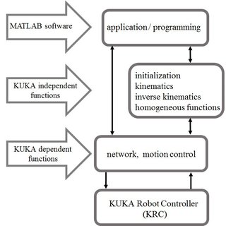
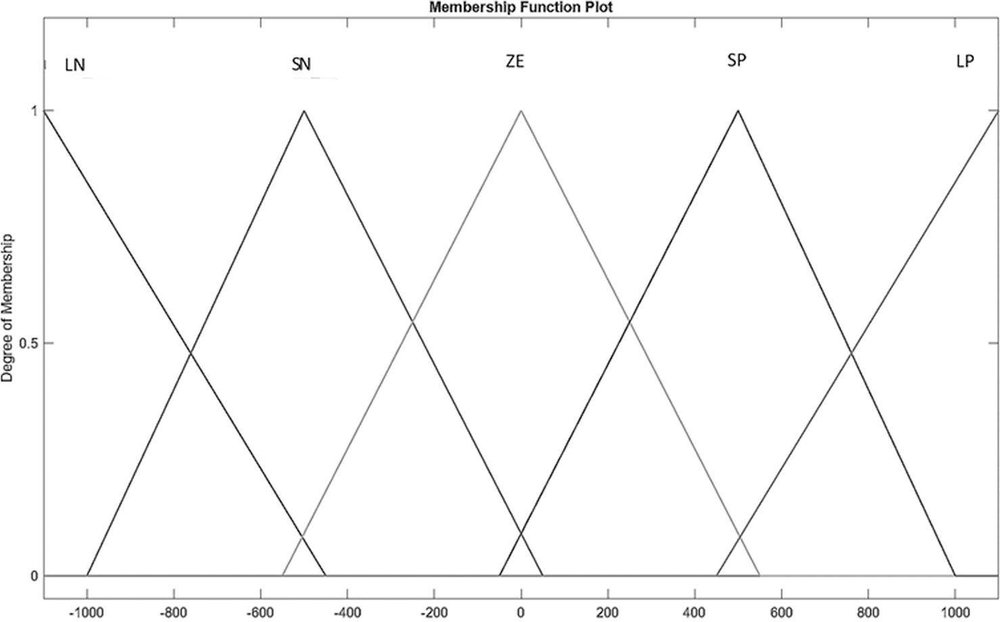
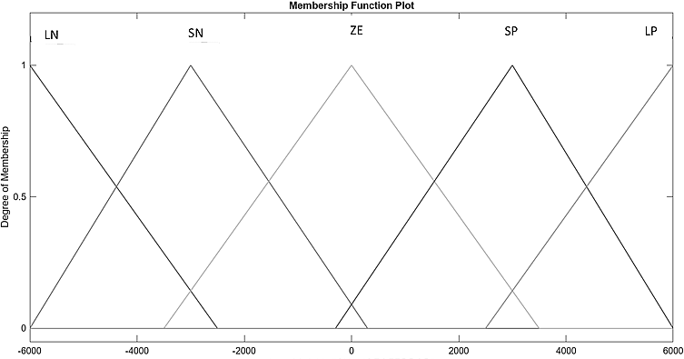
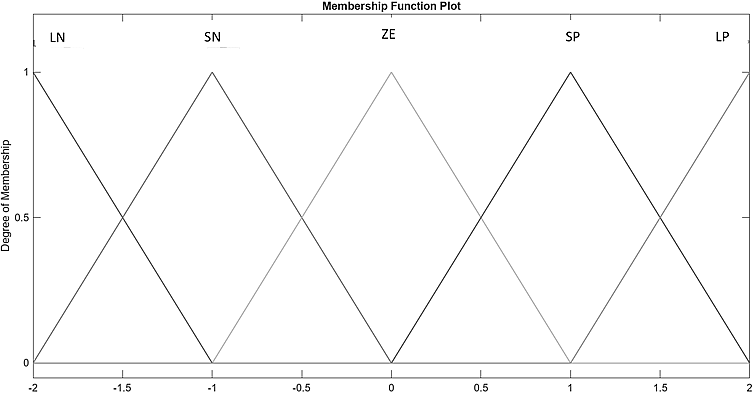
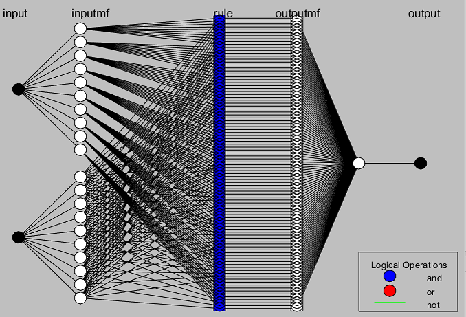
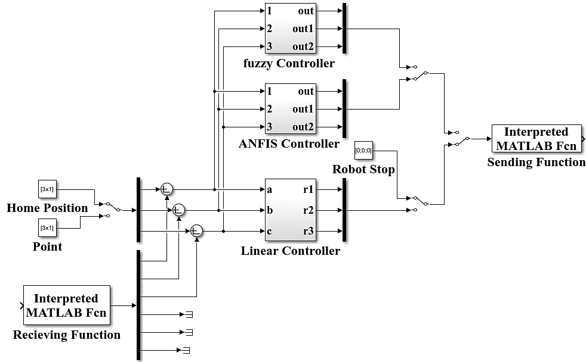
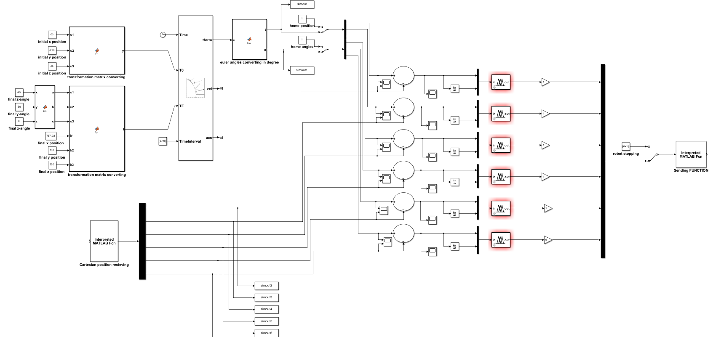
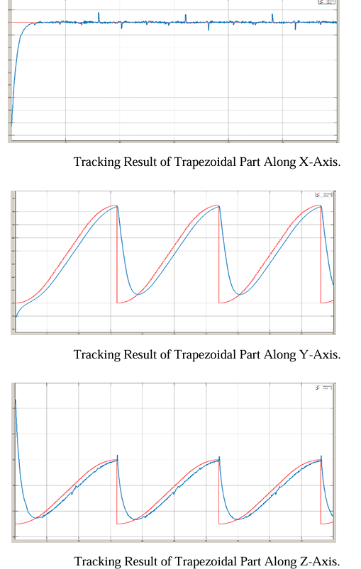

# Tracking-Control-Using-RSI
Development of ANFIS Controller for Trajectory Tracking Control Using ROBO2L MATLAB Toolbox for KUKA Industrial Robot via RSI.
# Research Backgroud
This work was done based on my first Master's thesis conducted at Hochschule bochum in germany.
# Problem
Firstly, the position control of the KUKA robot was done by linear controller that was designed in Hochschlu Bochum. this controller depends on the normalization of the position errors. that's limited the ability of the robot to track any trajectory. so to solve this problem, i designed FLC and ANFIS controller to control the velocity of the robot due to the ability of the ROBO2L MATLAB Toolbox to send the velocity values for the robot and recieve the cartesian position of the robot. this the Robot Sensor Interface (RSI) provides real time controlling of the robot.    
# Overview
The goal of this work is to develope high level controller for trajectory tracking control of real KUKA KR6 R900 SIXX by controlling its velocity using ROBO2L MATLAB Toolbox with RSI.In this work, the FLC, and ANFIS were developed based on point-to-point motion and compared with linear controller.
# Background
The RSI is a supplementary software component made by KUKA to transmitt the data between extrnal sensors of the system that were substituted and emulated by MATLAB and the robot's controller.
the ROBO2L toolbox uses the UDPtoRSI.dll Structure that was built using C language to enable the communication between robot and computer. it was established to connect with robot, reading and writiing the position of the robot and sending commands for the robot. the following figure illustrates the structure of ROBO2L MATLAB toolbox. 

# MATLAB Simulink Implementation 
The following figures illustrate selected parts of the simulink implementations that developed during this research. 

# Results
this section presents the experimentl results of the proposed ANFIS controller

[▶ Open Video](mix.mp4)
